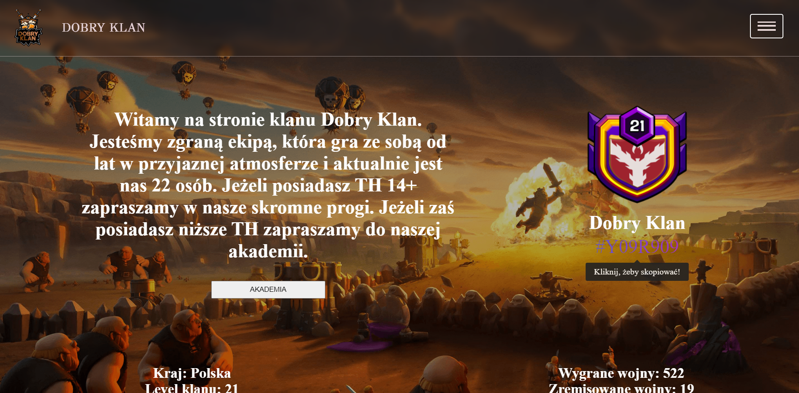

# Dobry Klan Clash Of Clans

## Live site

<a href="https://dobry-klan.netlify.app/">Dobry Klan Live Site</a>

## Technology Stack

## About Project

Simple page created for my friends from game Clash of Clans :grinning: Page and server deployed on Netlify for
more flexible server configuration. That's my first bigger project, I tried to use BEM methodology, Typescript, Node JS
and ReactJS. In my opinion the most difficult thing to do on page was a create a Node server with Express JS framework to connect with
two different endpoints to fetch data from Clash Of Clans API.

## Some result photos

#1 Main content

   
#2 Navigation menu

   

